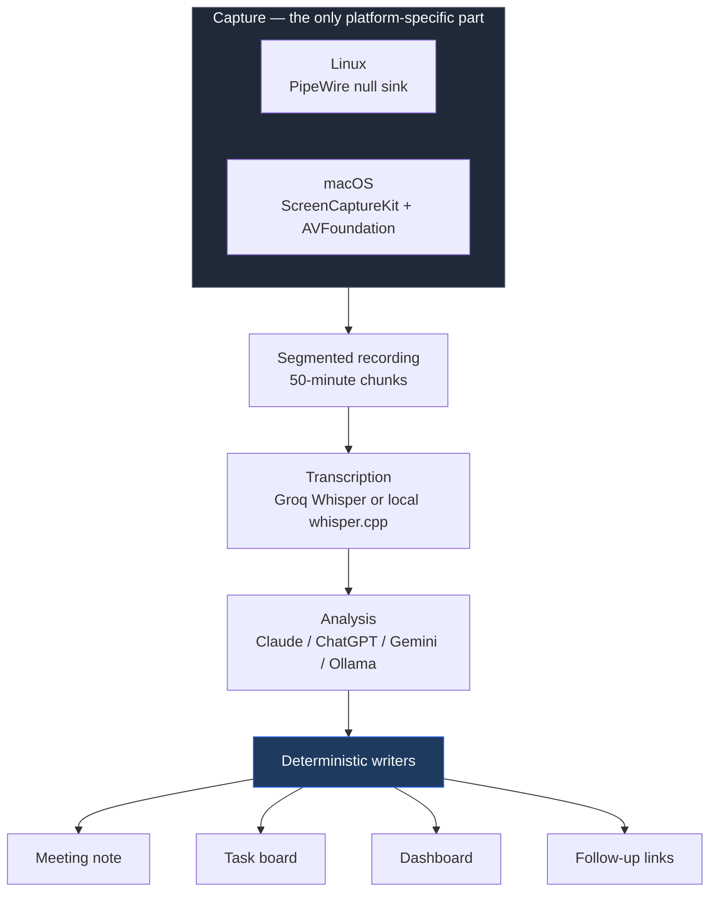
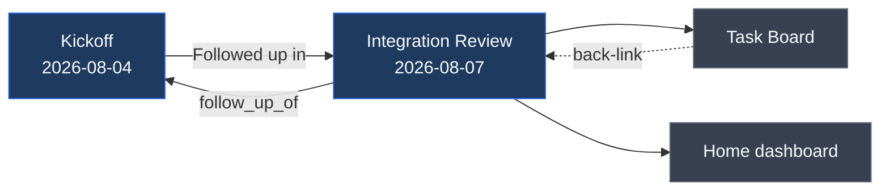
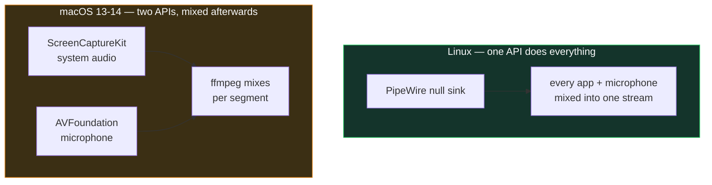

# BeyondMeetings

**Record a meeting, get structured notes in one private desktop app.**

beyondMeetings captures every voice on the call — not just your microphone —
transcribes it, and writes a meeting note with an executive summary, decisions,
action items and open questions. The desktop app includes the meeting library,
task board, search, dashboard data and linked follow-ups.

No meeting bot joins your call. No SaaS account and no external notes app. Your
notes remain portable Markdown files in an app-owned folder on your computer.

```
   Start                                                          Stop
     |                                                              |
     v                                                              v
  ┌──────────────────────────────────────────────────────────────────┐
  │  every audio source on the machine, mixed into one recording     │
  └──────────────────────────────────────────────────────────────────┘
                                    |
             transcribe -> analyse -> write
                                    |
     ┌──────────────┬───────────────┴───────────────┬──────────────┐
     v              v                               v              v
  Meeting note   Task board                     Dashboard     Follow-up
  with summary   entries with                   kept in       chain linked
  and actions    owners and dates               sync          both ways
```

## How it works



Two things in that diagram matter more than the rest.

**Capture is the only platform-specific part.** Everything downstream —
transcription, analysis, and every file written — is the same code on every
platform. A backend is selected once, at startup, and nothing else in the
system knows which one it got.

**The files are written by deterministic code, not by the model.** The model
decides *what the meeting was about*; Python decides what the markdown looks
like. Swapping providers changes summary quality, never structure or
correctness.

### Long meetings

Recording rolls over into a fresh segment every 50 minutes, and each closed
segment is transcribed in the background *while the next one records*.

```mermaid
gantt
    title A three-hour meeting, transcribed as it happens
    dateFormat HH:mm
    axisFormat %H:%M

    section Recording
    Segment 1     :a1, 00:00, 50m
    Segment 2     :a2, after a1, 50m
    Segment 3     :a3, after a2, 50m
    Segment 4     :a4, after a3, 30m

    section Transcribing
    Segment 1     :b1, 00:50, 6m
    Segment 2     :b2, 01:40, 6m
    Segment 3     :b3, 02:30, 6m
    Segment 4     :b4, 03:00, 4m
```



By the time you press Stop, almost everything is already done — and the
transcription API is never handed hours of audio at once, which is what keeps a
long meeting under rate limits.

## Installation

**Step 1 — install it.** One command:

```bash
curl -fsSL https://raw.githubusercontent.com/nikhilm55/beyondmeetings/main/install.sh | bash
```

Prefer to read the script first? That is reasonable:

```bash
curl -fsSL https://raw.githubusercontent.com/nikhilm55/beyondmeetings/main/install.sh -o install.sh
less install.sh
bash install.sh
```

If `raw.githubusercontent.com` is blocked on your network (`curl: (35)
Connection reset by peer`), the same file is served by a mirror:

```bash
curl -fsSL https://cdn.jsdelivr.net/gh/nikhilm55/beyondmeetings@main/install.sh | bash
```

It checks your system, installs into `~/.local/share/beyondmeetings-app`, adds
a `beyondmeetings` command to `~/.local/bin`, installs an app icon, and opens
the setup wizard.

On **macOS** the same command additionally compiles the capture helper and
assembles `~/Applications/beyondMeetings.app` — see
[macOS](#macos) first, because it needs the Xcode command line tools and has
not yet been verified on real hardware.

**Step 2 — finish the wizard.** It opens at `http://127.0.0.1:7788/setup`
automatically. Work down the checklist until the ring reads 100%:

- **Note writer** → **Claude Code** (needs no API key, uses your subscription)
- **Groq API key** → paste one from [console.groq.com](https://console.groq.com);
  it is verified with a live call before being saved
- **Local notes library** → created automatically in your app-data folder

**Step 3 — use it.** Click the **beyondMeetings** icon in your applications, or:

```bash
beyondmeetings open
```

Then hit **Start**, have your meeting, hit **Stop**. Or skip the UI:

```bash
beyondmeetings start "Client kickoff"
# … have your meeting …
beyondmeetings stop
```

Either way, stopping does everything: transcribes, analyses, writes the note,
updates your task board.

### If `beyondmeetings` is not found

`~/.local/bin` is not on your `PATH`. Add it:

```bash
echo 'export PATH="$HOME/.local/bin:$PATH"' >> ~/.bashrc && source ~/.bashrc
```

The installer warns you if this applies.

### Updating

```bash
curl -fsSL https://raw.githubusercontent.com/nikhilm55/beyondmeetings/main/install.sh | bash
```

Same command. Your settings, keys and recordings are left alone.

---

## What you get

For every meeting, a note at `Meetings/YYYY-MM-DD/[Title].md`. This is real
output from the renderer, not a mock-up:

```markdown
---
tags:
  - meeting
  - authentitas
  - payments
date: 2026-08-07
attendees:
  - Nikhil
  - Mayank
  - Priya
follow_up_of: "[[Meetings/2026-08-04/Payments API - Kickoff]]"
---

# Payments API — Integration Review

> [!note]- Follow-up to
> [[Meetings/2026-08-04/Payments API - Kickoff]]

## Executive Summary
The team walked through the sandbox integration ahead of Thursday. Token
refresh is the one open risk: the current implementation retries on a 401
without checking whether the refresh itself failed, which can loop. Priya will
cap it. Everything else is on track for the demo.

## Decisions Made
- Ship the sandbox integration behind a feature flag rather than delaying the demo.
- Refresh tokens cap at three attempts, then surface a re-auth prompt.

## Action Items
- [ ] **Cap token refresh retries at three** — **Priya** · Due: 2026-08-09
- [ ] **Write the webhook replay runbook** — **Mayank**
- [ ] **Confirm sandbox credentials with the vendor**

## Open Questions
- Does the vendor rate-limit the sandbox differently from production?

## Risks / Concerns
- Thursday demo depends on vendor sandbox uptime, which we do not control.

## Discussion
- Webhook ordering is not guaranteed, so the consumer has to be idempotent.
- Sandbox latency is roughly double production — noted, not a blocker.

---
*Transcribed with Groq Whisper · Generated by beyondMeetings (Claude)*
```

The built-in reader presents the note cleanly, while the underlying Markdown
keeps real checkboxes and portable `[[links]]`.

### The task board

Every action item also lands on `Tasks/Task Board.md`, with the project, a
priority inferred from how it was discussed, and a link back to the meeting it
came from:

```markdown
> > **==Cap token refresh retries at three==** · `Authentitas` · `HIGH`
> > Retrying a 401 without checking the refresh result can loop. — **Priya** · Due: 2026-08-09 · [[Meetings/2026-08-07/Payments API - Integration Review]]
> >
> > **==Write the webhook replay runbook==** · `Authentitas` · `MEDIUM`
> > Consumers must be idempotent; document the replay procedure. — **Mayank** · [[Meetings/2026-08-07/Payments API - Integration Review]]
```

### How it all links together



Follow-ups are detected from what was actually said, not from the meeting name
— a chain always links to its most recent entry, and both notes are updated so
the relationship reads correctly from either end.

The title is derived from what was discussed, so you never have to name a
meeting before it starts. Say "start recording" and deal with the name later.

---

## Requirements

**Linux, Windows 10+, or macOS 13+.** See [Platform support](#platform-support).

You also need:

- **ffmpeg** — the installer offers to install it
  (`brew install ffmpeg` on macOS)
- A **Groq API key** for transcription (free tier is ample), *or* local
  whisper.cpp
- A way to write notes — **your existing Claude/ChatGPT/Gemini subscription
  is enough**, see below

Run `beyondmeetings doctor` at any time to see what is missing.

---

## Platform support

| Platform | Capture backend | Status |
|---|---|---|
| **Linux** | PipeWire null sink | Supported and in daily use |
| **macOS 13+** | ScreenCaptureKit + AVFoundation | Implemented, **not yet verified on hardware** |
| **Windows 10+** | WASAPI loopback + microphone | Implemented; hardware verification needed |

Everything above the capture layer — transcription, analysis, notes, task
board, dashboard — is shared, so a new platform is one backend and its
packaging, not a fork.

### Windows

Open PowerShell in the downloaded project directory and run:

```powershell
Set-ExecutionPolicy -Scope Process Bypass
.\install.ps1
```

The installer creates an isolated environment under Local AppData, adds a
Start Menu shortcut, and opens the native setup window. Windows capture uses
WASAPI loopback for everyone else on the call and the default microphone for
your voice.

### macOS

**Read this before installing.** The macOS support is complete in the sense
that every piece exists and the Python side is fully tested. It has **never
been run on a Mac** — the capture helper is written in Swift and was authored
without hardware to compile it on. The first person to install it should expect
to debug the build, and is doing the shakedown run.

If you want something that is known to work today, use Linux.

#### Why macOS needs more than a new file



macOS has no equivalent of a null sink. System audio comes from
ScreenCaptureKit, the microphone from AVFoundation, and the two are only
unified in macOS 15 — below that they must be captured separately and mixed.
beyondMeetings mixes each 50-minute segment independently, so drift between the
two device clocks cannot accumulate over a long meeting.

The second problem is permissions. macOS keys privacy grants per *bundle
identifier*, and a `pip`-installed command has none, so grants would attach to
your terminal and not carry over to an app icon. That is why the installer
builds a real `beyondMeetings.app` and puts the capture helper inside it.

#### Installing on macOS

**Requirements:** macOS 13 (Ventura) or later, and the Xcode command line
tools. The installer compiles the capture helper from source rather than
shipping a binary, so nothing unsigned has to be trusted.

```bash
xcode-select --install
```

Then the same one-liner as Linux:

```bash
curl -fsSL https://raw.githubusercontent.com/nikhilm55/beyondmeetings/main/install.sh | bash
```

It installs into `~/.local/share/beyondmeetings-app`, compiles `bmcapture`,
and assembles `~/Applications/beyondMeetings.app`. Without the Xcode tools it
still installs and skips the helper — everything except recording works, and
re-running the installer afterwards adds it.

**Then grant two permissions.** Open the app once, then in System Settings →
Privacy & Security:

| Permission | Why | Required |
|---|---|---|
| **Screen Recording** | How macOS delivers system audio. Nothing is captured from your screen. | Yes — without it you record only yourself |
| **Microphone** | Your own voice | No — recording works without it, you are just missing from the transcript |

macOS requires the app to be **reopened** after granting Screen Recording
before it takes effect. Granting it and seeing no change is expected; quit and
reopen.

Run `beyondmeetings doctor` at any point — on macOS it checks the Xcode tools,
the helper, the app bundle, and both permissions, and links straight to the
right System Settings pane.

#### What to expect on the first run

Honest expectations, given it is unverified:

- The **Swift may not compile first time.** The build log is written to
  `~/.local/share/beyondmeetings-app/bmcapture-build.log`.
- **Permission attribution is the main unknown.** Whether macOS attributes the
  screen-recording grant to the app bundle for both launch paths — the app icon
  and `beyondmeetings start` in a terminal — could not be determined without
  hardware. If the terminal path prompts separately, use the app icon.
- Everything downstream of capture is the same code Linux runs, so if a
  recording is produced, the notes should be correct.

Bug reports from a real Mac are the single most useful contribution right now.
The design, including the open questions, is written up in
[`docs/superpowers/specs/2026-08-10-macos-support-design.md`](docs/superpowers/specs/2026-08-10-macos-support-design.md).

---

## Choosing your AI

**You do not need an API key.** If you already have a Claude, ChatGPT or
Gemini subscription with its CLI installed, beyondMeetings drives that — your
subscription does the work, and nothing is billed per token.

### No API key needed

| Provider | Needs | Notes |
|---|---|---|
| **Claude Code** | `claude` installed and signed in | **Recommended.** Best summary quality and follow-up detection. |
| **Codex CLI** | `codex` installed and signed in | Uses your ChatGPT subscription. |
| **Gemini CLI** | `gemini` installed and signed in | Uses your Google account. |
| **Ollama** | `ollama serve` + a pulled model | Fully local; nothing leaves your machine. Weaker on code-mixed speech (e.g. Hinglish). |

### API key required

These need a key **with credits**, which is separate from a subscription — a
Claude Pro plan does not come with API credits.

| Provider | Default model |
|---|---|
| Claude API | `claude-opus-5` |
| ChatGPT API | `gpt-4o` |
| Gemini API | `gemini-2.0-flash` |

Pick yours in the setup wizard. To use a different model, set `model` in
`~/.config/beyondmeetings/config.toml` — model names change faster than this
project releases, so the defaults are a starting point, not a constraint. If an
agent CLI needs a different invocation, set `agent_command` rather than
patching the code.

Whichever you choose, the *files* are identical — the notes, task board and
dashboard are written by deterministic Python, not by the model. The model
only decides what the meeting was about. Swapping providers changes summary
quality, never structure or correctness.

### Fully local transcription

Choose **whisper.cpp** in the wizard instead of Groq. You need to build the
binary yourself once (it needs a compiler, so the installer won't do it
silently):

```bash
git clone https://github.com/ggerganov/whisper.cpp
cd whisper.cpp && cmake -B build && cmake --build build -j
```

Then set `whisper_binary` in your config if it isn't on `PATH`. The wizard
downloads the model (~1.5 GB) for you.

---

## Privacy

By default your audio is sent to Groq for transcription, and the transcript is
sent to your chosen model provider. Nothing else leaves your machine, and
nothing is stored by beyondMeetings anywhere but your own disk.

Note that an agent CLI still sends the transcript to that provider — "no API
key" means no billing, not local-only.

For a fully local setup, choose **whisper.cpp** for transcription and
**Ollama** for notes. Then no audio and no transcript ever leaves the machine.

API keys are stored in your OS keyring, falling back to a `0600` file if no
keyring backend is available.

---

## Where things live

| What | Path |
|---|---|
| Config | `~/.config/beyondmeetings/config.toml` |
| Recordings and transcripts | `~/.local/share/beyondmeetings/` |
| The program itself | `~/.local/share/beyondmeetings-app/` |
| Notes library | Linux: `~/.local/share/beyondmeetings/library/`; macOS: `~/Library/Application Support/beyondmeetings/library/`; Windows: `%LOCALAPPDATA%\beyondmeetings\library\` |
| Meeting notes | `<notes library>/Meetings/YYYY-MM-DD/` |
| Task board | `<notes library>/Tasks/Task Board.md` |
| Dashboard | `<notes library>/Home.md` |

---

## Using it with a coding agent

The wizard generates `CLAUDE.md`, `AGENTS.md` and `GEMINI.md` in the library, so
Claude Code, Codex or Gemini CLI can start and stop recordings when you ask
them to. All three files are generated from one template — edit the template,
not the copies.

It also offers to register an MCP server giving your agent read access to the
library, so you can ask things like "what did we decide about the API last week?"
It uses `@modelcontextprotocol/server-filesystem` scoped to that folder — no
notes-app plugin and no second API key. Only agents you actually have installed
are touched, and your existing agent config is merged, backed up to `.bak`, and
never overwritten.

---

## Commands

| Command | Does |
|---|---|
| `beyondmeetings app` | Open the native Linux, Windows or macOS desktop app. What the app icon runs. |
| `beyondmeetings open` | Legacy browser launcher for headless/debug use. |
| `beyondmeetings serve` | Run the server in the foreground (page + tray icon). |
| `beyondmeetings start ["name"]` | Start recording. The name is optional. |
| `beyondmeetings stop` | Stop, transcribe, and write everything. |
| `beyondmeetings notes <transcript>` | Regenerate notes from an existing transcript. |
| `beyondmeetings doctor` | Check your installation. |
| `beyondmeetings setup` | Reopen the setup wizard. |

Open any meeting in the app to **Convert to PDF** or **Share** it. PDFs are
saved in the visible `Downloads/BeyondMeetings` folder. Share uses the native
share sheet when the desktop supports one; otherwise it reveals the PDF in the
file manager so it can be attached from any application without copying it out
of the hidden notes library.

The tray icon needs two extra packages, because the GTK/AppIndicator stack is
fiddly across desktops and not everyone wants it:

```bash
pip install 'beyondmeetings[tray]'
```

Without them, `serve` still runs the page — it just says so and skips the icon.

### If note generation fails

The transcript is written to disk **before** the AI is called. If the API is
down or your key expired, the app shows the transcript path and a **Regenerate
notes** button. Your recording is never lost to a failed API call.

---

## Uninstalling

```bash
./uninstall.sh
```

Removes the program, the command, your settings and the start-at-login entry.
**Your recordings, transcripts, API keys, local library and meeting notes are kept.**

```bash
./uninstall.sh --dry-run       # show what would go, change nothing
./uninstall.sh --purge-keys    # also forget your stored API keys
./uninstall.sh --purge-data    # also delete recordings and transcripts
```

The program is deliberately installed to a *different* directory from your
recordings, so removing it can never take your meetings with it.

---

## Contributing

See [CONTRIBUTING.md](CONTRIBUTING.md). Adding a model provider is roughly
forty lines — implement `LLMProvider` and add one entry to a table.

## License

MIT — see [LICENSE](LICENSE).
